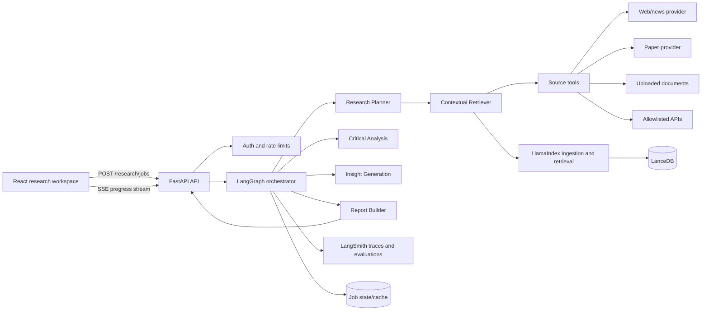

# Multi-Agent AI Deep Researcher

A shareable architecture and workshop guide for building an API-first, multi-agent research assistant with Python, FastAPI, React, OpenRouter, RAG, LanceDB, LlamaIndex, LangChain, LangSmith, LangGraph, and long-context synthesis.

## 1. Product brief

The user submits a research question. The system decomposes it into searchable sub-questions, retrieves evidence from multiple source types, analyzes source quality and disagreement, generates bounded hypotheses, and compiles a cited report. Every important claim should be traceable to a source excerpt.

### Hackathon success criteria

- Demonstrate a multi-hop question, not only a single web search.
- Show specialized agents and their intermediate outputs.
- Mix at least two source classes in one run.
- Display citations, source metadata, uncertainty, and contradictions.
- Keep the model provider replaceable through an OpenAI-compatible adapter.
- Make traces and evaluation visible enough for learners to understand why an answer was produced.

## 2. Scope and non-goals

### In scope

- Research jobs with streaming progress events.
- Web/news search, research paper search, document upload, and allowlisted external APIs.
- Hybrid retrieval: vector similarity plus metadata and keyword filters.
- Source normalization, deduplication, citation tracking, and report export.
- Human approval before expensive synthesis or publication.
- Local development first, then a Vercel frontend with a separately hosted FastAPI service.

### Out of scope for the first release

- Autonomous browsing without domain and budget limits.
- Medical, legal, financial, or safety-critical recommendations.
- Training or fine-tuning a foundation model.
- Fully reliable factuality guarantees. The product must communicate uncertainty.

## 3. System architecture



### Request lifecycle

1. React sends a `ResearchRequest` containing the question, source preferences, depth, and optional uploaded document IDs.
2. FastAPI validates the request, creates a job ID, and starts a LangGraph run. The API returns immediately for the asynchronous path.
3. The Planner produces a small set of sub-questions, search queries, source constraints, and a budget.
4. The Retriever calls source adapters concurrently, normalizes results into a common `EvidenceItem`, and writes chunks and embeddings to LanceDB.
5. The Critical Analysis agent scores source quality, extracts claims, checks support, and records contradictions.
6. The Insight agent proposes hypotheses only when supported by the evidence, labeling inference versus direct evidence.
7. A human approval checkpoint can pause the graph before report generation.
8. The Report Builder performs long-context synthesis from selected evidence, produces structured sections, and attaches citations.
9. FastAPI streams typed progress events and exposes the final report and source graph.

## 4. Agent design

The agents are graph nodes with narrow responsibilities. They communicate through typed state, not through hidden conversational history.

| Agent | Input | Output | Guardrail |
|---|---|---|---|
| Research Planner | User question and constraints | Sub-questions, queries, budget | Limit breadth and require a stopping rule |
| Contextual Retriever | Queries and source policy | Evidence items and retrieval log | Preserve URL, title, publisher, date, excerpt, and retrieval timestamp |
| Source Curator | Evidence items | Deduplicated ranked evidence | Do not silently discard disagreement |
| Critical Analysis | Ranked evidence | Claims, support scores, contradictions, gaps | Separate source statements from model interpretation |
| Insight Generation | Claims and gaps | Hypotheses, trends, confidence | No unsupported causal language |
| Report Builder | All approved artifacts | Markdown/JSON report and citations | Every material claim needs one or more citations |
| Verification Agent | Draft report and evidence | Citation checks and warnings | Fail closed on missing or mismatched citations |

### Optional additions

- **Citation Verifier:** checks that cited excerpts entail the nearby claim.
- **Research Librarian:** maintains reusable collections and source provenance.
- **Human Review Gate:** exposes a pause/resume decision for learners to inspect intermediate work.
- **Cost and Budget Monitor:** stops retrieval or synthesis after token, time, or source limits.

## 5. Shared state contract

Use Pydantic models at the API boundary and typed dictionaries or dataclasses inside the graph. A minimal state shape is:

```python
class ResearchState(TypedDict, total=False):
    job_id: str
    question: str
    constraints: ResearchConstraints
    sub_questions: list[SubQuestion]
    evidence: list[EvidenceItem]
    claims: list[Claim]
    contradictions: list[Contradiction]
    hypotheses: list[Hypothesis]
    report: Report | None
    warnings: list[str]
    events: list[ResearchEvent]
    error: str | None
```

The important rule is that source evidence is immutable after ingestion. Agents may add annotations, but they should never rewrite the original text or provenance.

## 6. Source and RAG architecture

### Source adapter contract

Every source integration implements the same interface:

```python
class SourceAdapter(Protocol):
    name: str

    async def search(self, query: str, limit: int) -> list[RawSource]: ...
    async def fetch(self, source: RawSource) -> SourceDocument: ...
```

Adapters should exist for:

- Web/news search: a provider with stable URLs and publication metadata.
- Research papers: OpenAlex, Crossref, Semantic Scholar, or another permitted API.
- Reports/documents: PDF extraction with page numbers and upload ownership checks.
- External APIs: explicit configuration, schema validation, rate limits, and allowlists.

### Ingestion pipeline

1. Fetch the source and retain the raw payload or a durable reference.
2. Normalize metadata: title, authors, publisher, date, URL, source type, license, and retrieved time.
3. Extract text while preserving page, section, or paragraph location.
4. Chunk by semantic boundaries with overlap; keep the source ID on every chunk.
5. Create embeddings through a configurable embedding model.
6. Store vectors and metadata in LanceDB.
7. Deduplicate by canonical URL, DOI, content hash, and near-duplicate similarity.
8. Return the top evidence with an excerpt and locator that can be cited.

LlamaIndex owns document parsing, indexing, and retrieval composition. LanceDB is the local, developer-friendly vector store. The retrieval layer should be replaceable so a hosted vector database can be added later.

### Retrieval policy

Use hybrid retrieval when possible: metadata filters for source type/date, lexical matching for named entities, and vector similarity for concepts. Retrieve more evidence than the final context needs, then let the Curator and Critical Analysis agents rank and prune it. Never treat vector similarity as factual support by itself.

## 7. API contract

The first API should be small and observable:

| Method | Path | Purpose |
|---|---|---|
| `GET` | `/health` | Liveness check |
| `POST` | `/research/jobs` | Create a research job |
| `GET` | `/research/jobs/{job_id}` | Read status and current artifacts |
| `GET` | `/research/jobs/{job_id}/events` | Stream progress with Server-Sent Events |
| `POST` | `/research/jobs/{job_id}/approve` | Resume a human review checkpoint |
| `GET` | `/research/jobs/{job_id}/report` | Fetch the final structured report |
| `POST` | `/documents` | Upload and index a document |

Example request:

```json
{
  "question": "How are small language models being used at the edge, and what tradeoffs are reported?",
  "source_types": ["papers", "news", "documents"],
  "time_range": {"from": "2023-01-01", "to": "2026-09-05"},
  "max_sources": 12,
  "depth": "standard",
  "require_human_approval": true
}
```

Example report shape:

```json
{
  "title": "Edge deployment of small language models",
  "executive_summary": "...",
  "findings": [{"claim": "...", "citations": ["ev_12"], "confidence": 0.78}],
  "contradictions": [{"topic": "latency", "sources": ["ev_04", "ev_09"], "explanation": "..."}],
  "hypotheses": [{"text": "...", "confidence": "medium", "basis": ["cl_03"]}],
  "limitations": ["..."],
  "sources": [{"id": "ev_12", "title": "...", "url": "...", "locator": "p. 4"}]
}
```

SSE events should be typed and replayable enough for a reconnecting client: `job.created`, `agent.started`, `agent.progress`, `source.found`, `review.required`, `report.ready`, and `job.failed`.

## 8. Prompt engineering standards

Prompts are versioned files, tested with fixtures, and never assembled from unsanitized user text without clear delimiters. Each agent prompt should specify role, task, allowed evidence, output schema, uncertainty behavior, and stop conditions.

### Planner prompt

```text
You are the Research Planner. Convert the user question into the smallest useful set of independently searchable sub-questions.

Question:
<question>{{question}}</question>
Constraints:
<constraints>{{constraints}}</constraints>

Return JSON matching the SubQuestion schema. Each sub-question must explain what evidence would count as an answer. Do not answer the question. Limit the plan to {{max_sub_questions}} items and include a stopping rule.
```

### Critical Analysis prompt

```text
You are the Critical Analysis Agent. Analyze only the evidence supplied below.

For each material claim, return: claim, supporting evidence IDs, opposing evidence IDs, confidence from 0 to 1, and what is still unknown. Distinguish direct quotation, source inference, and your own synthesis. If sources disagree, preserve both positions and explain whether the disagreement may be caused by dates, populations, methods, or definitions. Never invent a citation.
```

### Insight prompt

```text
You are the Insight Generation Agent. Propose a maximum of three hypotheses or trends from the verified claims.

Every hypothesis must list its evidence IDs, assumptions, counter-evidence, and a falsification test. Use cautious language. A hypothesis is not a fact and must never be presented as one in the final report.
```

### Report prompt

```text
You are the Report Builder. Write a decision-useful report from the approved analysis artifacts.

Rules:
- Cite every material factual statement with evidence IDs.
- Keep direct evidence, interpretation, and hypotheses in separate sections.
- Include contradictions, limitations, search coverage, and retrieval time.
- Do not add facts that are absent from the supplied artifacts.
- Return the Report schema, not free-form commentary.
```

## 9. Framework responsibilities

- **OpenAI Standard:** define a provider adapter using chat completions and structured outputs. OpenRouter is configured as an OpenAI-compatible base URL; model IDs live in environment configuration.
- **RAG basics:** teach chunking, embeddings, retrieval, reranking, grounding, and citation provenance.
- **LanceDB + LlamaIndex:** provide local indexing and retrieval with inspectable metadata.
- **Atlas:** use the Atlas concept as the research map: sources, claims, contradictions, and edges are first-class objects in the UI and API.
- **LangChain:** standardize model/tool interfaces and output parsers where they reduce glue code.
- **LangSmith:** trace graph runs, prompts, tool calls, latency, token usage, and evaluation feedback. Never send secrets or private document contents without an explicit policy decision.
- **LangGraph:** own durable orchestration, branching, retries, checkpoints, and human approval.
- **Long-context synthesis:** retrieve and curate a bounded evidence pack; use hierarchical summaries when the pack exceeds the model context budget.

## 10. Reliability, safety, and cost controls

- Validate all structured model outputs with Pydantic and retry only with a bounded retry count.
- Apply per-job limits for sources, pages, tokens, wall-clock time, and external requests.
- Add SSRF protections and an allowlist for fetched URLs and external APIs.
- Treat retrieved content as untrusted data; delimit it and instruct models to ignore embedded instructions.
- Store API keys only on the backend. The browser receives job artifacts, never provider credentials.
- Add caching by normalized query and source hash, with an explicit freshness policy.
- Expose confidence and limitations instead of a single opaque quality score.
- Keep audit records for source provenance, model name, prompt version, and retrieval timestamp.

## 11. Frontend experience

The first screen is a research workspace, not a marketing page. It should include:

- Research question composer with source filters, depth, and approval toggle.
- Live agent timeline showing the current node and meaningful progress.
- Research map showing sources, claims, contradictions, and citations.
- Report view with inline citation links and a source drawer.
- Failure and partial-result states that explain what completed and what did not.

The frontend should consume the API contract rather than reimplement orchestration. Use React state for active job and event stream; keep the report and source graph typed from shared API schemas or generated clients.

## 12. Implementation milestones

### Milestone 0: foundation

- Run the health endpoint and React shell.
- Add environment validation, CORS, typed API errors, and request IDs.
- Decide the initial model and source providers.

### Milestone 1: one complete path

- Implement `POST /research/jobs` with an in-memory job store.
- Add Planner, one Retriever adapter, and a Report Builder.
- Stream events and return citations from a fixture corpus.

### Milestone 2: RAG and multi-source evidence

- Add document upload and PDF parsing.
- Add LanceDB and LlamaIndex ingestion.
- Add papers and web/news adapters with normalization and deduplication.
- Add Critical Analysis and contradiction detection.

### Milestone 3: graph quality

- Move orchestration into LangGraph with checkpointing.
- Add human approval, retries, budget monitor, and Verification Agent.
- Instrument every node in LangSmith.

### Milestone 4: Atlas UI and evaluation

- Build the timeline, report, source drawer, and research map.
- Add golden questions with expected source IDs and citation checks.
- Capture latency, token cost, retrieval recall, citation precision, and human ratings.

### Milestone 5: deployment

- Deploy the React frontend to Vercel.
- Deploy FastAPI, worker execution, LanceDB storage, and job state to a Python-capable service with persistent storage.
- Configure the Vercel frontend with the public API URL and strict CORS.

## 13. Testing strategy

### Unit tests

- Source normalization and canonical URL logic.
- Chunking and metadata preservation.
- Pydantic request, event, claim, and report schemas.
- Citation validation and contradiction grouping.
- Prompt output parsing with malformed-output fixtures.

### Integration tests

- Fake source adapters through a complete LangGraph run.
- Fixture corpus retrieval with known expected evidence IDs.
- Human approval pause and resume.
- SSE event ordering and reconnect behavior.

### Evaluation set

Create 10 to 20 questions covering factual lookup, multi-hop synthesis, conflicting sources, stale sources, and insufficient evidence. Score:

- Retrieval recall at top-k.
- Citation precision and citation completeness.
- Claim support and contradiction preservation.
- Report usefulness by human review.
- Cost and latency per completed job.

A passing demo should prefer an honest partial report over a fluent unsupported answer.

## 14. Local setup

```bash
# Backend
cd backend
python -m venv .venv
source .venv/bin/activate
pip install -e '.[dev]'
cp .env.example .env
uvicorn app.main:app --reload --port 8000

# Frontend, in another terminal
cd frontend
npm run dev
```

Set `OPENROUTER_API_KEY` only in the backend `.env`. Start with a cheap configurable model and record the exact model ID in the LangSmith run metadata. Provider calls should be mocked in tests.

## 15. Vercel deployment note

Vercel is a good home for the React frontend. A long-running LangGraph workflow, SSE stream, LanceDB files, and uploaded PDFs should not be assumed to fit a short-lived Vercel function. For the hackathon, deploy the frontend to Vercel and the FastAPI API/worker to a Python-capable host with persistent storage. If a Vercel-centric setup is required, make the API a thin job-submission layer and run graph workers elsewhere; use a managed database/object store for state and documents.

Required production settings include `VITE_API_BASE_URL`, `CORS_ORIGINS`, `OPENROUTER_API_KEY`, model IDs, storage credentials, and LangSmith settings. Do not commit `.env` files.

## 16. Learner exercises

1. Replace the fixture Retriever with a paper adapter and preserve the `EvidenceItem` contract.
2. Add a contradiction fixture and make the Critical Analysis agent retain both sources.
3. Add a human approval checkpoint after analysis.
4. Compare vector-only retrieval with hybrid retrieval on the evaluation set.
5. Add a citation verifier and measure citation completeness before and after it.
6. Swap OpenRouter for another OpenAI-compatible provider without changing agent prompts.
7. Add a report export endpoint and a frontend source drawer.

## 17. Definition of done

The project is ready for the hackathon demo when a learner can clone it, configure one provider key, submit a multi-hop question, watch at least three agent nodes run, inspect source-backed claims and contradictions, approve synthesis, and download a report whose material claims link to evidence. The demo should also show one deliberately limited case where the system reports insufficient evidence.
